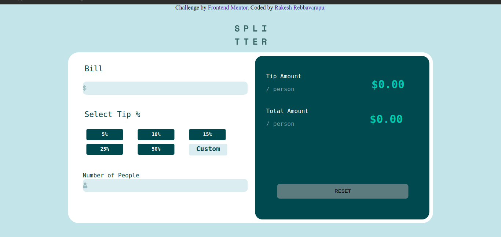

#Free Mentor - Tip Calculator app solution

This is a solution to the [Tip calculator app challenge on Frontend Mentor](https://www.frontendmentor.io/challenges/tip-calculator-app-ugJNGbJUX). Frontend Mentor challenges help you improve your coding skills by building realistic projects.

## Table of contents

- [Overview](#overview)
  - [The challenge](#the-challenge)
  - [Screenshot](#screenshot)
  - [Links](#links)
- [My process](#my-process)
  - [Built with](#built-with)
  - [What I learned](#what-i-learned)
  - [Continued development](#continued-development)
- [Author](#author)
- [Acknowledgments](#acknowledgments)

## Overview

### The challenge
Users should be able to:

- View the optimal layout for the app depending on their device's screen size
- See hover states for all interactive elements on the page
- Calculate the correct tip and total cost of the bill per person

### Screenshot

- Solution URL: (https://github.com/rakesh-thecoder/tip-calculator)
- Live Site URL: [Add live site URL here](https://frontend-tip-calculator.netlify.app/)

## My process

### Built with
- Semantic HTML5 markup
- CSS custom properties
- Flexbox

### What I learned
Well, this is my first project which made to focus on javascript. I don't use js much, but this project help me to learn a lot 

### Author
 Website - [Rakesh Rebbavarapu](https://rakesh-thecoder.netlify.app)
- Frontend Mentor - [@rakesh-devep](https://www.frontendmentor.io/profile/rakesh-devep)
- Twitter - [@rakesh_thecoder](https://www.twitter.com/rakesh_thecoder)
- Instagram - [@theamigoooooo](https://www.instagram.com/theamigoooooo)
- Linkedin - [@rakesh_thecoder](https://www.linkedin.com/rakesh-thecoder)

### Acknowledgements
